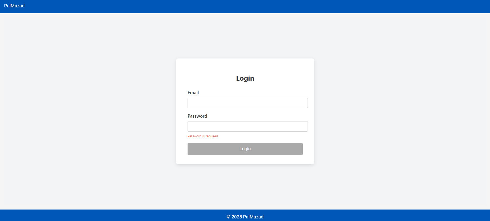
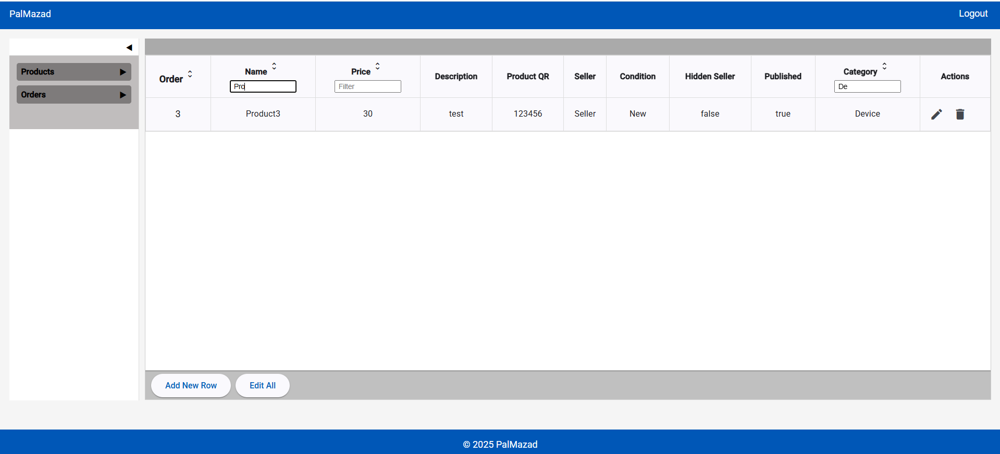
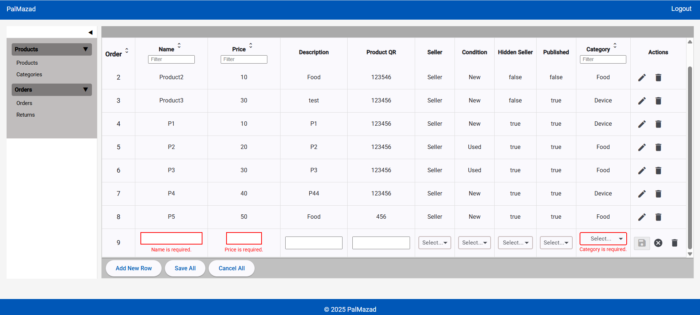
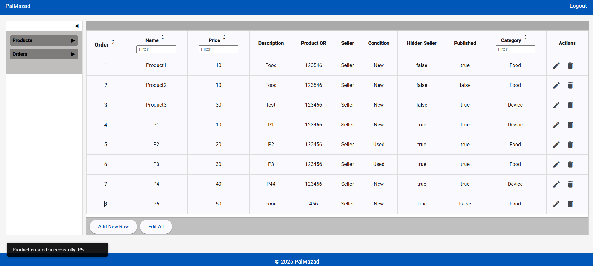
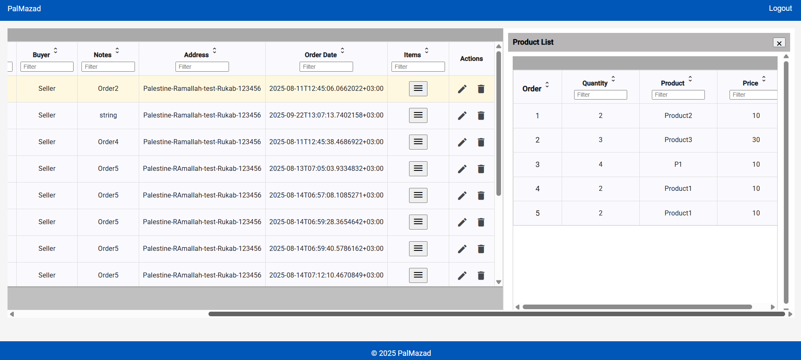
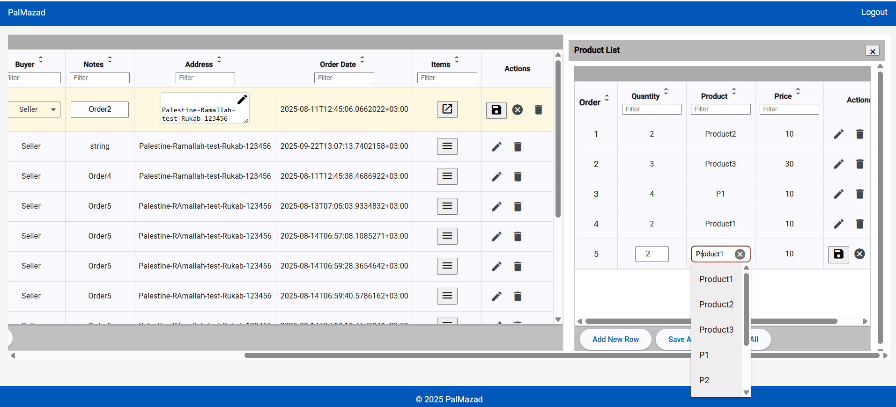
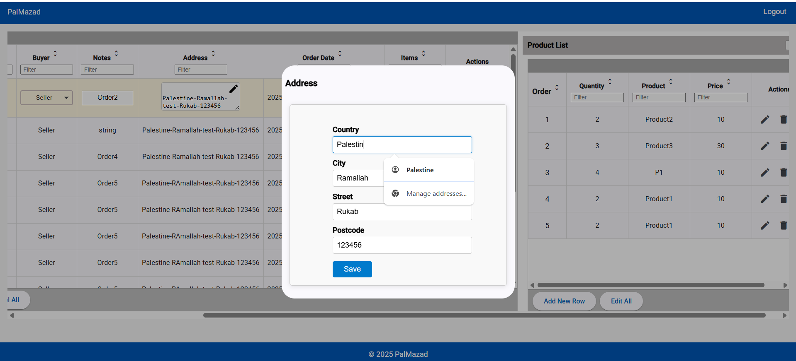

# 🟨 WebPalMazad

Modern Angular frontend application built with a modular architecture for the PalMazad marketplace platform.

---

## 🚀 Overview

WebPalMazad is the Angular frontend of the PalMazad marketplace ecosystem.

It communicates with the PalMazad ASP.NET Core API to provide a modern, maintainable, and feature-rich user experience for managing marketplace operations.

---

## 📷 Screenshots

### 🔐 Login

---

### 📦 Product Management

---

### ➕ Create New Product

---

### ✅ Operation Success Notification

---

### 📄 Order Details

---

### ✏️ Edit Order

---

### 📍 Edit Shipping Address

---

## 🧠 Architecture

- Feature-based architecture
- Standalone Components
- Lazy Loading
- Dependency Injection
- Shared Services
- Reusable UI Components
- Modular and maintainable project structure

---

## ⚙️ Key Features

- Authentication & Authorization
- Login & User Management
- Product Management (CRUD)
- Categories Management
- Order Management
- Shopping Cart
- Dashboard
- REST API Integration
- Route Guards
- Reactive Forms
- HTTP Interceptors
- Sorting & Filtering
- Client-side Validation
- Reusable Editable Grid Component

---

## 🛠️ Tech Stack

- Angular
- TypeScript
- Angular Material
- RxJS
- HTML5
- CSS3

---

## 🧩 Project Structure

The application follows a modular architecture where each feature is isolated into its own module or standalone components, making the codebase easier to maintain, test, and extend.

---

## 🔗 Related Projects

- 🟦 PalMazad API → https://github.com/MohammadDarAbed/PalMazad
- 🔐 Authentication Service → https://github.com/MohammadDarAbed/Authentication
- 📘 Developer Documentation → https://github.com/MohammadDarAbed/dev-docs

---

## 🚧 Future Improvements

- Responsive Design
- UI/UX Enhancements
- Performance Optimization
- Dark Mode
- Localization (Arabic & English)